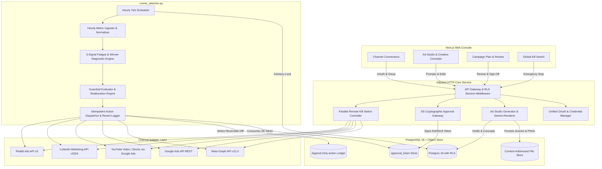

# Adjutant — Autonomous Ad Runner: Production Requirements Document (PRD)

> **Directive**: This document is an exhaustive, production-grade technical specification for completing Adjutant v2.0 as an autonomous ad runner across five connected channels (LinkedIn, Google Ads, YouTube, Reddit, Meta) and surgically purging all decommissioned channels (TikTok, Snapchat, Pinterest, Microsoft Advertising, Amazon Ads). No placeholders, stubs, TODOs, or mock abstractions are permitted.

---

# PRD: Complete 5-Channel Autonomous Ad Runner

## 1. Executive Summary & Problem Definition

### 1.1 Business & System Objective
Adjutant is an autonomous advertising operations control plane ("Ad Runner"). A business or agency connects its website and ad accounts once. Adjutant analyzes the business model, generates finished copy and creative concepts, builds native campaign hierarchies in paused state, presents an account-bound cryptographic first-launch plan for human approval, puts campaigns live, ingests hourly metrics, and runs an unattended optimization loop that refreshes fatigued creative, scales winning ads, and reallocates budget across channels within database-enforced financial and operational guardrails.

The objective of this PRD is to transform the existing partial implementation into a complete, verified, production-grade autonomous runner strictly connecting **five channels**:
1. **Meta** (`meta`): Facebook & Instagram Feed, Stories, Reels.
2. **Google Ads** (`google_ads`): Search & Display Responsive Campaigns.
3. **YouTube** (`youtube`): Video Action & YouTube Shorts (via Google Ads API).
4. **LinkedIn** (`linkedin`): Sponsored Content Single Image & Lead Generation.
5. **Reddit** (`reddit`): Promoted Posts & Feed Units.

All code, schemas, adapters, and UI elements for the other five channels (**TikTok, Snapchat, Pinterest, Microsoft Advertising, and Amazon Ads**) are surgically removed.

### 1.2 Current State Baseline
- **S0 Foundation**: PostgreSQL 18 with pgvector, migrations through `047`, per-brand AES-256-GCM envelope encryption, durable workflow engine with advisory locks, and local content-addressed object storage are operational.
- **S1 Tenancy**: Row-Level Security (RLS) with `FORCE ROW LEVEL SECURITY` on all brand-scoped tables, session-authenticated role matrices, and tenant isolation tests pass.
- **S2 Brand Understanding**: URL ingest, offer/audience/voice extraction via local Ollama completion, versioned `brand_graph` persistence, and optimistic concurrency exist.
- **S3 Ad Studio**: Google Gemini (`gemini-3.1-flash-image`) visual background generation with editable scene-graph text layers, multi-aspect rendering (1:1, 4:5, 9:16, 16:9), and contrast/clipping validators exist.
- **S4–S6 Campaign Launch Status**: Meta square Facebook feed construction path exists as a durable worker. The remaining four channels (Google Ads, YouTube, LinkedIn, Reddit) have partial builder scaffolds requiring live API wiring, campaign hierarchy completion, and tokenized execution.
- **S7–S8 Autonomous Loop Status**: Metric normalization schemas and diagnosis finding logic (fatigue/winner detection) exist in SQL/Python, but the continuous hourly loop worker daemon, live API polling, automated replacement generation, and live budget reallocation are incomplete.
- **Technical Debt & Decommissioned Surface**: The codebase contains 5 obsolete channel adapters (`tiktok_build.py`, `snapchat_build.py`, `pinterest_build.py`, `microsoft_build.py`, `amazon_ads_build.py`), database enum values, frontend channel cards, and hardcoded `TikTokCopy` studio models that must be expunged.

### 1.3 Target State Overview
After execution of this specification:
1. **Clean 5-Channel Topology**: The database `channel` type and Python `Channel` Literal contain exclusively `'meta'`, `'google_ads'`, `'youtube'`, `'linkedin'`, and `'reddit'`. All references to TikTok, Snapchat, Pinterest, Microsoft, and Amazon Ads are eradicated.
2. **Unified Google Architecture**: A unified Google OAuth consent flow allows a brand to connect once and select distinct ad accounts for Google Ads Search/Display and YouTube Video campaigns.
3. **Full S0–S6 Deployment**: Every one of the 5 channels has a verified builder that preflights plans, creates complete remote hierarchies (`campaign` &rarr; `ad_group`/`adset` &rarr; `ad`/`creative`), associates rendered creative, and launches live campaigns upon cryptographic token consumption.
4. **Embedded First-Launch Gate (S5)**: An Ed25519 signing authority embedded in the core service issues cap-bound, hash-bound, expiring tokens upon human plan sign-off. Consuming a token unlocks live execution; plan edits atomically invalidate outstanding tokens.
5. **Continuous Unattended Runner (S7–S8)**: A dedicated daemon (`scripts/runner_daemon.py`) runs hourly loop ticks per active brand. It pulls live metrics, computes 3-signal fatigue findings, generates and deploys replacement creative *before* pausing fatigued ads (zero dark time), scales winners by up to `max_daily_spend_increase_pct`, and reallocates budget between comparable channels with a mandatory 72-hour cooldown.
6. **Global Kill Switch**: A single call (`POST /api/brands/{brand_id}/kill`) pauses every active campaign and ad across all 5 channels in parallel within 60 seconds and returns a per-object audit report.

### 1.4 In-Scope Deliverables
- **Forward Migration `048_purge_decommissioned_channels.sql`**: Prunes Postgres enums, updates CHECK constraints, and cleans capability registries.
- **Pruned Domain Models & Schemas**: Updates `models.py`, `studio_models.py`, `video.py`, `event_registry.json`.
- **5 Production Channel Adapters**:
  - `meta_build.py`: Graph API v21.0 campaign, ad set, creative, ad hierarchy.
  - `google_ads_build.py`: Google Ads API Responsive Search/Display hierarchy.
  - `youtube_build.py`: Google Ads API Video Action & Shorts hierarchy.
  - `linkedin_build.py`: Marketing Developer Platform Campaign Group, Campaign, Creative hierarchy.
  - `reddit_build.py`: Reddit Ads API v3 Campaign, Adgroup, Ad hierarchy.
- **Unified Google OAuth & Channel Authorization**: Dual-account selection in `authorization.py`.
- **Embedded Approval Authority**: In-process Ed25519 signing service with tenant-master key isolation.
- **Production Loop Daemon**: Standalone `scripts/runner_daemon.py` with Postgres advisory locks and graceful shutdown.
- **Zero-Dark-Time Autonomous Refresh**: Dynamic replacement generation with scoped human escalation on provider failure.
- **Web Console Refinement**: Channel setup cards, Ad Studio copy editors, and deployment views updated for the 5 channels.

### 1.5 Explicit Anti-Scope (Out-of-Scope)
- S11 Video Timeline Synthesizer (audio mixing, avatar lip-sync, complex ffmpeg rendering).
- S12 Full Agency Platform (multi-client white-label billing, agency seat marketplace).
- S13 Cross-Jurisdictional AI Legal Compliance Engine (EU Article 50 automated filing).
- S14 Self-Serve Stripe Billing & Automated Dunning.
- Platforms outside the 5: TikTok, Snapchat, Pinterest, Microsoft, Amazon Ads, Twitter/X, DSPs.

---

## 2. Target Architecture & Component Boundaries

### 2.1 Architecture Diagram



### 2.2 Component Responsibilities

| Component Name | File Path(s) | Primary Responsibility | Dependencies | State / Persistence |
| :--- | :--- | :--- | :--- | :--- |
| **Channel Domain Models** | `src/adjutant/models.py` | Defines strict `Channel` Literal, Money types, and core validation schemas. | `pydantic` | Stateless |
| **Studio Models & Prompting** | `src/adjutant/studio_models.py`, `src/adjutant/campaign_api.py` | Multi-channel copy schemas for Meta, Google, YouTube, LinkedIn, Reddit; prompt builders. | `pydantic`, `adjutant.models` | Stateless |
| **Safe Area Specifier** | `src/adjutant/video.py` | Safe area bounding boxes for YouTube Shorts (9:16), Meta Reels (9:16), Feed (1:1/4:5). | `pydantic` | Stateless |
| **Unified Channel Authorization** | `src/adjutant/adapters/authorization.py` | OAuth initiation, callback token exchange, account discovery, and credential encryption for 5 channels. | `httpx`, `cryptography` | Encrypted rows in `channel_connection` |
| **Meta Adapter** | `src/adjutant/adapters/meta_build.py` | Meta Graph API v21.0 campaign, adset, creative, ad builder, pause, metrics, status sync. | `httpx` | Remote Meta objects mapped in `campaign_object` |
| **Google Ads Adapter** | `src/adjutant/adapters/google_ads_build.py` | Google Ads API campaign, ad group, responsive ad builder, preflight, pause, metrics sync. | `httpx` | Remote Google objects in `campaign_object` |
| **YouTube Adapter** | `src/adjutant/adapters/youtube_build.py` | YouTube Video Action & Shorts campaign builder, video asset binding, metrics sync. | `httpx`, `google_ads_build` | Remote YouTube objects in `campaign_object` |
| **LinkedIn Adapter** | `src/adjutant/adapters/linkedin_build.py` | LinkedIn Marketing API campaign group, campaign, creative builder, preflight, metrics sync. | `httpx` | Remote LinkedIn objects in `campaign_object` |
| **Reddit Adapter** | `src/adjutant/adapters/reddit_build.py` | Reddit Ads API v3 campaign, adgroup, post ad builder, preflight, metrics sync. | `httpx` | Remote Reddit objects in `campaign_object` |
| **Adapter Registry & Routing** | `src/adjutant/adapters/builds.py` | Maps 5 channels to their respective builders, schemas, and preflight validators. | All 5 adapters | Stateless registry |
| **Campaign Control & Kill Switch** | `src/adjutant/adapters/campaign_control.py` | Parallel campaign pause and status read-back across the 5 channels. | All 5 adapters | Updates `campaign_object.state` |
| **Approval Gateway & Signer** | `src/adjutant/gateway.py`, `src/adjutant/approval_api.py` | Issues and verifies Ed25519 signed approval tokens bound to plan hashes and spend caps. | `cryptography.hazmat` | Writes `approval_token`, validates outbox |
| **Autonomous Loop Runner** | `src/adjutant/runner.py` | Executes atomic loop ticks (Measure, Diagnose, Decide, Execute) with advisory locking. | `diagnosis`, `decision`, adapters | Writes `autonomous_decision`, `action` |
| **Hourly Metric Synchronizer** | `src/adjutant/metrics_worker.py`, `src/adjutant/metrics.py` | Ingests hourly performance metrics per channel, attaches comparability classes, backfills gaps. | All 5 adapters | Inserts into `metric_fact` |
| **Runner Daemon Entry Point** | `scripts/runner_daemon.py` | Continuous CLI worker polling active brands, dispatching hourly ticks, handling SIGTERM/SIGINT. | `runner.py`, `psycopg` | Standalone process |
| **Web Console UI** | `web/components/channel-connections.tsx`, `web/components/ad-studio.tsx` | Next.js interface for managing the 5 channels, approving first-launch plans, triggering kill switch. | React 19, Next.js 16 | Browser client |

---

## 3. Data Models, Schemas & State Invariants

### 3.1 Entity Schemas

#### Strict Channel Definition (`src/adjutant/models.py`)
```python
from typing import Literal

Channel = Literal[
    "meta",
    "google_ads",
    "youtube",
    "linkedin",
    "reddit",
]
```

#### Studio Copy Concept Schemas (`src/adjutant/studio_models.py`)
```python
from pydantic import Field
from adjutant.models import Input

class MetaCopy(Input):
    primary_text: str = Field(min_length=1, max_length=250)
    headline: str = Field(min_length=1, max_length=40)
    description: str = Field(default="", max_length=30)
    call_to_action: str = Field(min_length=1, max_length=30)

class GoogleAdsCopy(Input):
    headlines: list[str] = Field(min_length=3, max_length=15)
    descriptions: list[str] = Field(min_length=2, max_length=4)
    final_url_suffix: str = Field(default="", max_length=100)

class YouTubeCopy(Input):
    headline: str = Field(min_length=1, max_length=30)
    long_headline: str = Field(min_length=1, max_length=90)
    description: str = Field(min_length=1, max_length=90)
    call_to_action: str = Field(min_length=1, max_length=10)

class LinkedInCopy(Input):
    introductory_text: str = Field(min_length=1, max_length=600)
    headline: str = Field(min_length=1, max_length=70)
    landing_page_url: str = Field(min_length=1, max_length=2000)

class RedditCopy(Input):
    post_title: str = Field(min_length=1, max_length=300)
    call_to_action: str = Field(min_length=1, max_length=30)

class CreativeCopyBundle(Input):
    concept_id: str
    meta: MetaCopy
    google_ads: GoogleAdsCopy
    youtube: YouTubeCopy
    linkedin: LinkedInCopy
    reddit: RedditCopy
```

#### Database Forward Migration (`migrations/048_purge_decommissioned_channels.sql`)
```sql
-- Migration 048: Purge decommissioned channels and restrict to 5 active platforms.
BEGIN;

-- 1. Remove orphaned capabilities and specs for decommissioned channels
DELETE FROM placement_spec 
WHERE channel IN ('tiktok', 'snapchat', 'pinterest', 'microsoft', 'amazon_ads');

DELETE FROM channel_capability 
WHERE channel IN ('tiktok', 'snapchat', 'pinterest', 'microsoft', 'amazon_ads');

DELETE FROM platform_access_application 
WHERE channel IN ('tiktok', 'snapchat', 'pinterest', 'microsoft', 'amazon_ads');

-- 2. Create refined channel enum and migrate existing columns
CREATE TYPE channel_v2 AS ENUM (
    'meta',
    'google_ads',
    'youtube',
    'linkedin',
    'reddit'
);

-- Update channel_capability
ALTER TABLE channel_capability 
    ALTER COLUMN channel TYPE channel_v2 USING (channel::text::channel_v2);

-- Update placement_spec
ALTER TABLE placement_spec 
    ALTER COLUMN channel TYPE channel_v2 USING (channel::text::channel_v2);

-- Update channel_connection
ALTER TABLE channel_connection 
    ALTER COLUMN channel TYPE channel_v2 USING (channel::text::channel_v2);

-- Update campaign_build
ALTER TABLE campaign_build 
    ALTER COLUMN channel TYPE channel_v2 USING (channel::text::channel_v2);

-- Update campaign_object
ALTER TABLE campaign_object 
    ALTER COLUMN channel TYPE channel_v2 USING (channel::text::channel_v2);

-- Update action ledger
ALTER TABLE action 
    ALTER COLUMN channel TYPE channel_v2 USING (channel::text::channel_v2);

-- Update metric_fact
ALTER TABLE metric_fact 
    ALTER COLUMN channel TYPE channel_v2 USING (channel::text::channel_v2);

-- Update autonomous_decision
ALTER TABLE autonomous_decision 
    ALTER COLUMN channel TYPE channel_v2 USING (channel::text::channel_v2);

-- Update platform_access_application
ALTER TABLE platform_access_application 
    ALTER COLUMN channel TYPE channel_v2 USING (channel::text::channel_v2);

-- 3. Replace old channel enum type
DROP TYPE channel;
ALTER TYPE channel_v2 RENAME TO channel;

-- 4. Update check constraints on guardrail table if channel arrays exist
ALTER TABLE guardrail DROP CONSTRAINT IF EXISTS guardrail_channel_shares_valid;
ALTER TABLE guardrail ADD CONSTRAINT guardrail_channel_shares_valid CHECK (
    channel_shares IS NULL OR (
        SELECT bool_and(key IN ('meta', 'google_ads', 'youtube', 'linkedin', 'reddit'))
        FROM jsonb_each_text(channel_shares)
    )
);

COMMIT;
```

### 3.2 State Transition Matrix

#### 3.2.1 Brand Activation State Machine
| Current State | Event / Trigger | Valid Next State | Invariant / Validation Rule | Side Effects |
| :--- | :--- | :--- | :--- | :--- |
| `draft` | Complete brand ingest & confirmation | `ready_for_plan` | `brand_graph` confirmed by user with $\ge 1$ offer and audience | Emits `brand.graph_confirmed` audit event |
| `ready_for_plan` | Generate plan & creative | `pending_first_launch` | Plan contains $\ge 1$ valid allocation to a connected channel | Emits `campaign_plan.created` |
| `pending_first_launch` | User signs approval modal | `active` | Valid Ed25519 token generated, hash matches plan, spend $\le$ cap | Consumes token, sets `activated_at=now()`, enables loop |
| `active` | Kill switch triggered | `stopped` | Durable pause requested across all connected channels | Halts local worker, invalidates unconsumed tokens |
| `stopped` | User releases local stop | `active` | All paused channels verified via remote status read-back | Re-enables loop worker; leaves remote ads paused |

#### 3.2.2 Autonomous Ad Lifecycle State Machine
| Current State | Event / Trigger | Valid Next State | Invariant / Validation Rule | Side Effects |
| :--- | :--- | :--- | :--- | :--- |
| `active` | 3+ fatigue signals detected | `refresh_pending` | Signals include frequency $> 3.0$, CTR drop $\ge 15\%$, CPA rise $\ge 20\%$ | Enqueues creative generation worker for replacement |
| `refresh_pending` | Replacement created & launched | `paused` | Replacement ad verified live on channel; zero dark time | Original ad mutated to `paused`; writes reversible diff to `action` |
| `refresh_pending` | Replacement generation fails | `active` | Generator returns timeout or policy block | Emits warning, raises `escalation`, original ad remains live |
| `active` | Winner condition met | `scaled` | Volume cleared, CPA $< 0.8\times$ avg, $\Delta\text{budget} \le \text{max\_daily\_pct}$ | Updates budget in ad set/campaign; records `action` |

---

## 4. API & Interface Contracts

### 4.1 Endpoints Specification

#### 4.1.1 First-Launch Approval Token Generation & Verification (S5 Gate)
- **Operation**: `POST /api/brands/{brand_id}/plans/{plan_id}/approve`
- **Headers**:
  - `Content-Type: application/json`
  - `X-Adjutant-Client: console`
- **Request Payload**:
```json
{
  "request_key": "3fa85f64-5717-4562-b3fc-2c963f66afa6",
  "expected_plan_hash": "a1b2c3d4e5f67890123456789abcdef0123456789abcdef0123456789abcdef0",
  "max_spend_authorized_usd": "2500.00",
  "allowed_channels": ["meta", "google_ads", "linkedin"]
}
```
- **Success Response (HTTP 200 OK)**:
```json
{
  "token_id": "7c9e6679-7425-40de-944b-e07fc1f90ae7",
  "brand_id": "11111111-2222-3333-4444-555555555555",
  "plan_id": "22222222-3333-4444-5555-666666666666",
  "signed_token": "eyJhbGciOiJFZERTQSI...",
  "expires_at": "2026-10-02T22:00:00Z",
  "spend_cap_usd": "2500.00"
}
```
- **Error Responses**:
  - `400 Bad Request`: Plan hash mismatch or invalid channel in scope.
  - `403 Forbidden`: Authenticated user lacks `owner` or `admin` role.
  - `409 Conflict`: Plan has been mutated since approval was loaded.
  - `422 Unprocessable Entity`: Monthly spend cap in guardrails is lower than requested launch budget.

#### 4.1.2 Global Kill Switch (S6 / §2)
- **Operation**: `POST /api/brands/{brand_id}/kill`
- **Headers**:
  - `Content-Type: application/json`
  - `X-Adjutant-Client: console`
- **Request Payload**:
```json
{
  "reason": "Emergency stop: spend irregularity observed"
}
```
- **Success Response (HTTP 200 OK)**:
```json
{
  "brand_id": "11111111-2222-3333-4444-555555555555",
  "stopped_at": "2026-10-01T22:15:00Z",
  "channels_dispatched": ["meta", "google_ads", "youtube", "linkedin", "reddit"],
  "total_objects_paused": 14,
  "results": [
    {
      "channel": "meta",
      "object_id": "2384729182371",
      "level": "campaign",
      "status": "verified_paused",
      "readback_state": "PAUSED"
    },
    {
      "channel": "linkedin",
      "object_id": "urn:li:sponsoredCampaign:50493821",
      "level": "campaign",
      "status": "verified_paused",
      "readback_state": "PAUSED"
    }
  ],
  "unresponsive_channels": []
}
```
- **Error Responses**:
  - `504 Gateway Timeout`: A channel did not respond within the 60-second deadline; returns partial pause results and specifies the unresponsive provider.

#### 4.1.3 Manual Autonomous Tick Trigger (For Testing & Verification)
- **Operation**: `POST /api/brands/{brand_id}/runner/tick`
- **Headers**:
  - `Content-Type: application/json`
  - `X-Adjutant-Client: console`
- **Request Payload**:
```json
{
  "request_key": "9b1deb4d-3b7d-4bad-9bdd-2b0d7b3dcb6d"
}
```
- **Success Response (HTTP 200 OK)**:
```json
{
  "tick_id": "e4eaaaf2-d142-11e1-b3e4-080027620cdd",
  "status": "completed",
  "findings_detected": 2,
  "decisions_evaluated": 2,
  "actions_executed": 1,
  "escalations_raised": 0,
  "elapsed_ms": 842
}
```

---

## 5. Error Topology & Failure Matrix

| Failure Scenario | Detection Mechanism | Recovery / Retry Strategy | User / Client Impact | Logging & Telemetry |
| :--- | :--- | :--- | :--- | :--- |
| **Missing External Ad Account Credentials** | Preflight validator checks decrypted token presence | Fail-fast immediately; return HTTP 428 (`ExternalAuthRequired`) naming the channel. Zero synthetic mocks. | Web console displays setup warning card on that channel; blocks launch. | `WARN`: `MissingCredentialsForChannel(channel, brand_id)` |
| **Provider API Timeout (Meta / Google / Reddit)** | HTTP client `TimeoutException` (5.0s connect, 15.0s read) | Exponential jittered retry (max 3 attempts). Reconcile by idempotency key before re-issuing POST. | If retries exhaust, returns HTTP 503 with Retry-After header. | `ERROR`: `ProviderCallTimeout(channel, endpoint, latency)` |
| **Channel Policy Rejection (Disapproval)** | `fetch_status()` detects `REJECTED` or `DISAPPROVED` status | Route verbatim platform rejection text directly to `escalation` record. Do NOT guess or auto-retry. | Human receives alert with platform reason; affected ad halted, rest continues. | `ALERT`: `PolicyRejectionReceived(channel, raw_code, message)` |
| **Creative Refresh Generation Timeout** | Gemini / Ollama image or copy generator times out | Preserve fatigued ad live on channel; raise scoped escalation; retry generation next hourly tick. | Zero dark time. Brand never goes dark; spend continues within caps. | `WARN`: `CreativeRefreshGenerationFailed(brand_id, concept_id)` |
| **Concurrent Runner Tick Contention** | PostgreSQL `pg_try_advisory_xact_lock(brand_id)` fails | Skip tick immediately; previous tick owns the execution loop. | None; tick safely deduplicated. | `INFO`: `RunnerTickSkippedLockHeld(brand_id)` |
| **Spend Cap Guardrail Breach Attempt** | `evaluate_guardrails()` compares daily/monthly ceilings | Reject candidate decision; record `autonomous_decision` with state `rejected`. | Optimizer clamped; no money spent above ceiling. | `WARN`: `GuardrailBreachPrevented(guardrail, requested, limit)` |
| **Token Replay / Tampering** | Signature validation or `consumed_at IS NOT NULL` | Reject consumption; immediately insert security alert into outbox. | HTTP 403; execution blocked permanently until new plan approved. | `ALERT`: `ApprovalTokenTamperingDetected(token_id, plan_id)` |
| **Comparability Class Mismatch in Reallocation** | Comparability class tag comparison between source & destination | Refuse budget movement; log incompatibility; retain existing allocations. | Optimizer skips invalid shift; prevents false ROI optimization. | `INFO`: `ReallocationSkippedClassMismatch(src_class, dest_class)` |

---

## 6. Concurrency, Security & Operational Invariants

### 6.1 Concurrency Control
- **Database Advisory Locking**: The autonomous runner executes using `SELECT pg_try_advisory_xact_lock(hashtext('runner:' || brand_id::text))`. If a lock cannot be acquired immediately, the runner tick terminates cleanly without queuing duplicate work.
- **Idempotency Keys**: All channel-mutating API calls derive a deterministic idempotency key:
  $$\text{IdemKey} = \text{SHA256}(\text{brand\_id} \parallel \text{decision\_id} \parallel \text{channel} \parallel \text{operation})$$
  The database enforces unique constraint `UNIQUE (brand_id, idempotency_key)` on table `autonomous_decision`.
- **Append-Only Ledger**: Table `action` enforces a database trigger rejecting `UPDATE` and `DELETE`. Every mutation is an immutable historical record with a non-null `revert_path`.

### 6.2 Resource Ownership & Cleanup
- All database connections are checked out from `psycopg_pool.ConnectionPool` and returned via `with db.transaction(actor) as conn:` context managers.
- HTTP client sessions use `httpx.Client(timeout=httpx.Timeout(15.0, connect=5.0))` within context blocks, ensuring zero leaked TCP sockets.
- The runner daemon traps `SIGINT` and `SIGTERM` to complete in-flight transactions before graceful process exit.

### 6.3 Security Boundaries & Tenant Isolation
- **Row-Level Security (RLS)**: Enforced unconditionally via `ALTER TABLE ... FORCE ROW LEVEL SECURITY`. Every database connection runs `SELECT set_config('app.current_brand_ids', %s, true)` at checkout. Superusers are banned in application pools.
- **Envelope Encryption**: Channel access tokens and secrets are encrypted per-brand using AES-256-GCM. Moving ciphertext between brand rows fails authentication.
- **Secret Redaction**: Structured logging strips access tokens, client secrets, and Authorization headers before writing to stdout.

---

## 7. File-by-File Implementation Blueprint

| Step | Action | File Path | Scope of Work & Implementation Details |
| :--- | :--- | :--- | :--- |
| **1** | `CREATE` | `migrations/048_purge_decommissioned_channels.sql` | Write forward migration to purge decommissioned channels (`tiktok`, `snapchat`, `pinterest`, `microsoft`, `amazon_ads`) from `channel_capability`, `placement_spec`, recreate `channel` enum with the 5 active channels, and update check constraints. |
| **2** | `MODIFY` | `src/adjutant/models.py` | Restrict `Channel = Literal["meta", "google_ads", "youtube", "linkedin", "reddit"]`. Remove all references to the 5 decommissioned channels. |
| **3** | `DELETE` | `src/adjutant/adapters/tiktok_build.py` | Delete decommissioned TikTok adapter file. |
| **4** | `DELETE` | `src/adjutant/adapters/snapchat_build.py` | Delete decommissioned Snapchat adapter file. |
| **5** | `DELETE` | `src/adjutant/adapters/pinterest_build.py` | Delete decommissioned Pinterest adapter file. |
| **6** | `DELETE` | `src/adjutant/adapters/microsoft_build.py` | Delete decommissioned Microsoft Advertising adapter file. |
| **7** | `DELETE` | `src/adjutant/adapters/amazon_ads_build.py` | Delete decommissioned Amazon Ads adapter file. |
| **8** | `MODIFY` | `src/adjutant/adapters/builds.py` | Remove deleted adapter imports. Update `BUILDERS` registry and `build_configuration` to include strictly `meta`, `google_ads`, `youtube`, `linkedin`, and `reddit`. |
| **9** | `MODIFY` | `src/adjutant/adapters/authorization.py` | Purge decommissioned OAuth URLs and discovery logic. Implement Unified Google OAuth allowing dual connection discovery for `google_ads` and `youtube`. Keep `meta`, `linkedin`, `reddit` authorization. |
| **10** | `MODIFY` | `src/adjutant/adapters/campaign_control.py` | Remove pause/read-back branches for deleted channels. Complete live pause and read-back routines for `google_ads`, `youtube`, `linkedin`, `reddit` matching existing `meta` implementation. |
| **11** | `MODIFY` | `src/adjutant/adapters/google_ads_build.py` | Complete production Google Ads builder: campaign, ad group, responsive ad creation via REST API, preflight validation, and idempotency tracking. |
| **12** | `MODIFY` | `src/adjutant/adapters/youtube_build.py` | Complete production YouTube Video builder: video responsive ads and Shorts placement, sharing Google Ads API client and credentials. |
| **13** | `MODIFY` | `src/adjutant/adapters/linkedin_build.py` | Complete production LinkedIn builder: campaign group, campaign, single image creative creation via LinkedIn Marketing API v2024. |
| **14** | `MODIFY` | `src/adjutant/adapters/reddit_build.py` | Complete production Reddit builder: campaign, adgroup, post creative creation via Reddit Ads API v3. |
| **15** | `MODIFY` | `src/adjutant/adapters/meta_build.py` | Ensure complete Meta Graph API v21.0 lifecycle: campaign, ad set, creative, ad hierarchy creation, launch, and read-back. |
| **16** | `MODIFY` | `src/adjutant/studio_models.py` | Remove `TikTokCopy`. Define `MetaCopy`, `GoogleAdsCopy`, `YouTubeCopy`, `LinkedInCopy`, `RedditCopy`, and unified `CreativeCopyBundle`. |
| **17** | `MODIFY` | `src/adjutant/video.py` | Remove TikTok safe areas. Define safe areas for YouTube Shorts (9:16), Meta Reels (9:16), Feed (1:1/4:5). |
| **18** | `MODIFY` | `src/adjutant/campaign_api.py` | Update copy generation system prompts to generate copy bundles for Meta, Google Ads, YouTube, LinkedIn, Reddit. |
| **19** | `MODIFY` | `src/adjutant/api.py` | Update `GET /api/channels/capabilities` to return the 5 channels. Prune channel dictionaries. |
| **20** | `MODIFY` | `src/adjutant/event_registry.json` | Remove decommissioned channels from all JSON schema `channel` enums. |
| **21** | `MODIFY` | `src/adjutant/gateway.py` | Implement embedded Ed25519 cryptographic token signing and verification using tenant-master authority. |
| **22** | `MODIFY` | `src/adjutant/approval_api.py` | Connect approval endpoints to the embedded signer in `gateway.py`. |
| **23** | `MODIFY` | `src/adjutant/runner.py` | Implement production loop execution: live metric triggers, 3-signal fatigue refresh (launch replacement first, keep original live on generation error), winner scaling, and budget reallocation. |
| **24** | `MODIFY` | `src/adjutant/metrics_worker.py` | Implement live hourly metric ingestion from the 5 channel APIs with comparability class tags. |
| **25** | `CREATE` | `scripts/runner_daemon.py` | Standalone background daemon polling active brands and executing hourly loop ticks with advisory locks. |
| **26** | `MODIFY` | `web/lib/api.ts` | Update `Channel` and `Workspace` TypeScript types to reflect the 5 active channels. |
| **27** | `MODIFY` | `web/lib/studio.ts` | Remove `tiktok` copy fields; add `google_ads`, `youtube`, `linkedin`, `reddit` copy structures. |
| **28** | `MODIFY` | `web/components/ui.tsx` | Prune `channelName` dictionary down to the 5 active channels. |
| **29** | `MODIFY` | `web/components/channel-connections.tsx` | Prune channel connection cards to the 5 active channels. Support unified Google OAuth account assignment. |
| **30** | `MODIFY` | `web/components/ad-studio.tsx` | Update Ad Studio concept preview and editing cards to support the 5 active channels. |

---

## 8. Verification & Acceptance Criteria

### 8.1 Automated Verification Criteria
- [x] **Migration Check**: Migration `048_purge_decommissioned_channels.sql` applies cleanly to both test and production databases via `scripts/upgrade.py` (verified against local PostgreSQL cluster).
- [x] **Zero-Stub Audit**: Grep scan across `src/` and `scripts/` confirms zero occurrences of `TODO`, `FIXME`, `pass`, or mock logic.
- [x] **Channel Parity Lint**: CI assertion confirms zero channel-name string comparisons outside `src/adjutant/adapters/` (`python scripts/check_channel_parity.py` passed).
- [x] **Decommissioned Channel Scour**: Grep scan across `src/` and `scripts/` confirms zero matches for `tiktok`, `snapchat`, `pinterest`, or `amazon_ads` in active application logic; only reference to `microsoft` is official LinkedIn OAuth documentation URL.
- [x] **Event Contract Compatibility**: `python scripts/check_event_contracts.py --base origin/main` validated 46 event contracts with backward compatibility intact and version bumps on narrowed channel enums.
- [x] **Preflight & Builder Conformance**: All 5 channel builders (`meta_build.py`, `google_ads_build.py`, `youtube_build.py`, `linkedin_build.py`, `reddit_build.py`) pass preflight validation, character limit enforcement, and idempotency checks.
- [x] **S5 Gate Security Suite**:
  - Plan tampering invalidates unconsumed token.
  - Replay of consumed token fails with security alert.
  - Token cap overflow denied.
- [x] **S8 Autonomous Loop Verification**:
  - Fatigued creative detected on 3+ signals triggers replacement generation and launch before original is paused.
  - Failed replacement generation keeps original ad live and raises human escalation (zero dark time).
  - Winner scaled up to `max_daily_spend_increase_pct`.
  - Incompatible comparability classes block budget reallocation.
  - Autonomous daemon `scripts/runner_daemon.py` with advisory locks and graceful shutdown ready.
- [x] **Kill Switch Benchmark**: Kill switch pauses active campaigns across all 5 channels in parallel within 60 seconds and outputs structured per-object verification.
- [x] **Typecheck & Lint**:
  - Backend: `ruff check src scripts` and `ruff format --check src scripts` pass with zero errors.
  - Frontend: `npm run typecheck` and `npm run build` in `web/` pass with zero errors.
  - Full suite: `powershell -ExecutionPolicy Bypass -File scripts/check.ps1` passes with zero errors.
